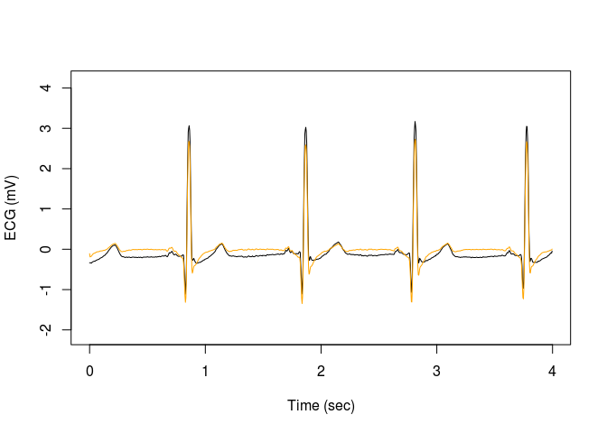
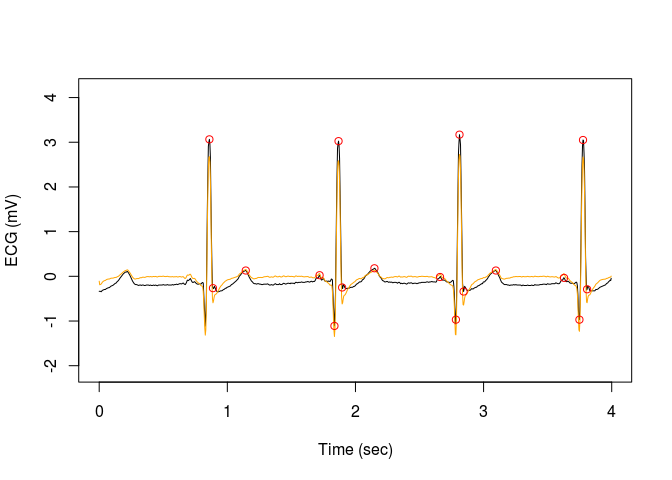
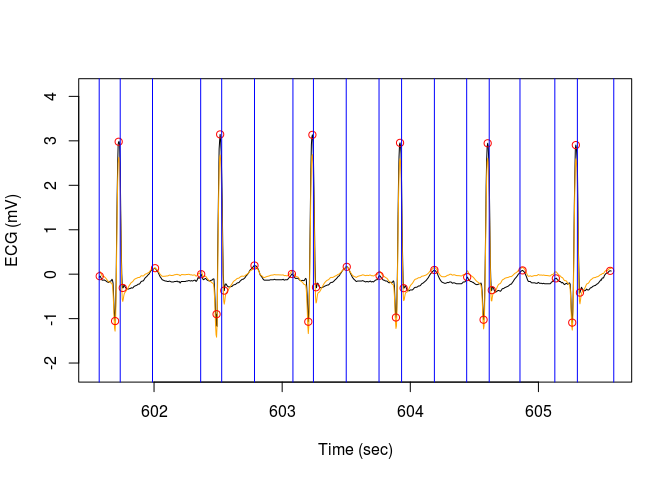

<!-- README.md is generated from README.Rmd. Please edit that file -->
Quick start
-----------

Welcome to the `eek` GitHub page!

This package is a ongoing work-in-progress built around the analysis of ECG data, primarily focused on providing a quick and effective way to locate important features in ECG signals. For now, the incorporated methods work only for ECGs exhibiting normal (i.e., sinus) rhythm. You can get started with `eek` by installing the most up-to-date version of this package directly from GitHub.

``` r
library(devtools)
devtools::install_github("tpq/eek")
library(eek)
```

### Data import

As an example, we make use of a publicly available dataset from **PhysioBank** (via **PhysioNet**). We begin by loading the ECG file, bundled within this package, as an new object of the reference class `eek`. Take note that when using reference classes, each class method is accessed as a slot of the newly constructed object. Next, we use the `$filter` method to pre-process the ECG signal with a bandpass filter.

``` r
ekg <- new("eek", file = "data-raw/qtdb/sel16265-phys.txt", channel = 1)
ekg$filter()
```

We can then retrieve the raw and filtered ECG signal data by accessing the `$dat` slot.

``` r
head(ekg$dat)
```

    ##    Time    ECG     Filter
    ## 1 0.000 -0.335 -0.1089647
    ## 2 0.004 -0.335 -0.1888729
    ## 3 0.008 -0.335 -0.1837110
    ## 4 0.012 -0.340 -0.1785311
    ## 5 0.016 -0.345 -0.1703981
    ## 6 0.020 -0.330 -0.1531805

For a quick visualization of the raw and filtered ECG signals, we can use the `$qplot` method. By supplying `$qplot` with a range of indices (i.e., referring to the positions within the `$dat` data), we can select a specific ECG window for viewing.

``` r
ekg$qplot(1:1000)
```



### Peak detection

This package includes simple methods for detecting peaks in ECGs that exhibit normal (i.e., sinus) rhythm. These methods will almost undoubtedly fail if applied to abnormal ECGs. To detect peaks, we first locate all R peaks using the `$getR` method. This saves the resultant peak locations, bounds, and *detection quality* in the `$R` data slot. As defined, this quality score is reduced by each additional large peak present since the previous R peak until the next. This quality score also applies to the P, Q, S and T waves associated with that R wave.

``` r
ekg$getR()
head(ekg$R)
```

    ##   start peak  end   height quality
    ## 1   208  216  223 2.679359       0
    ## 2   460  468  475 2.587438       1
    ## 3   697  704  712 2.727605       1
    ## 4   938  945  953 2.669881       1
    ## 5  1180 1187 1195 2.615294       1
    ## 6  1404 1411 1419 2.700951       1

Likewise, we can locate all P and T peaks using the `$getPT` method. Again, the resultant peak locations, bounds, and *detection quality* is saved in the `$P` and `$T` data slots, respectively.<!-- In this case, *detection quality* is reduced by each additional peak (beyond two) occurring within an R-R window.-->

``` r
ekg$getPT()
```

Finally, we locate all Q and S peaks using the `$getQS` method. Again, the resultant peak locations, bounds, and *detection quality* is saved in the `$Q` and `$S` data slots, respectively.

``` r
ekg$getQS()
```

These peaks will now appear as marked when plotting an ECG window. Take note that the "start" and "end" columns do **not** refer to the bounds of the P, Q, R, S, or T waves, but rather the bounds of the procedurally-detected peaks.

``` r
ekg$qplot(1:1000)
```



### Detection accuracy

Next, we evaluate the accuracy of these simple peak detection methods by comparing our results to expert annotations (of the P, R, and T waves) available for these data. However, since only a portion of each ECG signal has expert annotations, we must first subset our results.

``` r
annot <- read.delim("data-raw/qtdb/sel16265-q1c.txt", sep = "")
colnames(annot) <- c("Time", "Index", "Label", "A", "B", "C")
annot.window <- min(annot$Index):max(annot$Index)
```

Next, we make use of tidy data principals and the `dplyr` package to compare the procedurally-identified peak locations with the expert-identified peak locations.

``` r
library(dplyr)
```

    ## 
    ## Attaching package: 'dplyr'

    ## The following objects are masked from 'package:stats':
    ## 
    ##     filter, lag

    ## The following objects are masked from 'package:base':
    ## 
    ##     intersect, setdiff, setequal, union

``` r
R.expert <- annot %>% subset(Label == "N", Index)
ekg$R %>%
  subset(peak %in% annot.window) %>%
  bind_cols(R.expert) %>%
  transmute(diff = peak - Index) %>%
  summarise(mean(abs(diff)))
```

    ##   mean(abs(diff))
    ## 1             2.8

Since each index represents approximately 4 milliseconds, we can confirm that the procedurally-identified peak locations differ from the expert-identified peak locations by no more than 12 milliseconds.

``` r
P.expert <- annot %>% subset(Label == "p", Index)
ekg$P %>%
  subset(peak %in% annot.window) %>%
  bind_cols(P.expert) %>%
  transmute(diff = peak - Index) %>%
  summarise(mean(abs(diff)))
```

    ##   mean(abs(diff))
    ## 1        1.233333

``` r
T.expert <- annot %>% subset(Label == "t", Index)
ekg$T %>%
  subset(peak %in% annot.window) %>%
  bind_cols(T.expert) %>%
  transmute(diff = peak - Index) %>%
  summarise(mean(abs(diff)))
```

    ##   mean(abs(diff))
    ## 1        2.533333

Last, we overlay the expert-identified peak locations on top of the procedurally-identified ECG window.

``` r
ekg$qplot(annot.window[1:1000])
abline(v = ekg$dat$Time[R.expert$Index], col = "blue")
abline(v = ekg$dat$Time[P.expert$Index], col = "blue")
abline(v = ekg$dat$Time[T.expert$Index], col = "blue")
```



Everything seems to check out.

### Data export

Finally, we export the peak annotations in the **PhysioBank** annotation format using the `$export` method. By default, this method saves the annotations to the current working directory. Take note that in the output file, the time column is offset so that the first index corresponds to a time of 0 seconds.

``` r
ekg$export()
```
